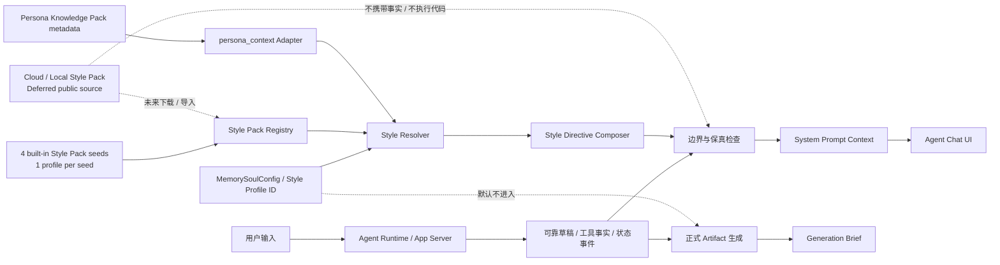
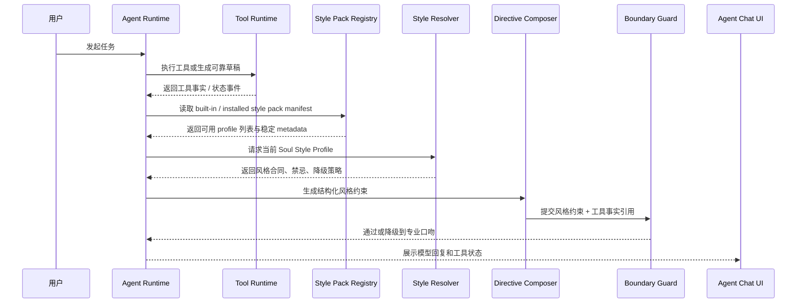
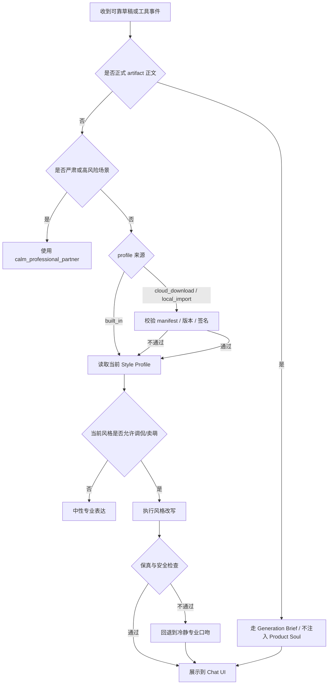

# Soul 可切换交互口吻 Style Profiles

> 状态：current planning source；四风格 / 风格包扩展持续同步
> 更新时间：2026-07-06
> 目标：把 Ribbi 式“有固定人格的助手口吻”收敛为 Soul 下的可切换 Style Profile 能力，不新增 PersonalStyle 平行系统，不训练小模型作为首版依赖。

## 1. 背景

近期对比的 Ribbi 截图体现了一个明确产品信号：用户不仅需要模型“完成任务”，还会感知助手是否有稳定人格、固定说话方式、工具执行前后的情绪节奏，以及失败时是否像一个可信的伙伴。

现状中 Lime 已有几块基础：

1. Soul 路线图已经定义“Lime 默认怎么和用户说话、以什么人格互动”。
2. Knowledge persona pack 已能承载人设资料，并声明其只用于口吻、表达风格、价值观、禁忌和可确认事实。
3. Agent Runtime / App Server / Agent UI 已有工具事实、工具状态、read model 和工具卡片展示链路。
4. `agentMessageList` 已有中性的工具过程文案，但还不是可切换的人格化表达层。

因此本能力不应另建 `personalstyle` 路线图或第二套 prompt composer。它应作为 Soul 的子能力：**Style Profile 是 Global Soul 的交互口吻预设，负责“怎么说”，不负责“事实是什么”。**

## 2. 目的

首版目标：

1. 提供 4 种可切换的交互风格，覆盖贱兮兮执行、温柔陪伴、拽酷行动、专业严肃四类主场景。
2. 通过 Prompt / 模板 / 规则 / guard 实现，不先训练小模型。
3. 把风格应用在聊天交互、工具调用前后、工具状态总结、正文转折、缺参数追问、失败解释和结尾建议等互动层。
4. 保持工具结果、资料事实、正式 artifact 与 Soul 口吻的边界清晰。
5. 为后续自定义风格、导入 `SOUL.md`、persona pack 联动和评测闭环预留一致抽象。

非目标：

1. 不新增 `personal_style_*` 数据库主链。
2. 不新增独立 Personal Style Runtime。
3. 不让风格层编造工具结果、搜索结论、图片结果或用户资料。
4. 不让 Product Soul 默认进入文章、脚本、海报文案、PPT 等正式 artifact。
5. 不把 LoRA / QLoRA 小模型训练作为第一版必须能力。
6. 不在首版实现公开 Cloud 风格包下载、市场、同步、付费或远程执行；App Server 本地 store core、JSON-RPC API 和设置页本地导入 / 管理骨架已作为受控扩展点接入，Cloud transport、签名实测和安装审计继续延期。

## 3. 收益

| 受益方     | 收益                                                                           |
| ---------- | ------------------------------------------------------------------------------ |
| 普通用户   | Lime 更像一个固定伙伴，而不是每次随机换语气的通用助手。                        |
| 创作者     | 可在创作前期用轻松或温柔风格陪伴，但正式产物仍由 Generation Brief 管控声线。   |
| 品牌运营者 | 后续可把品牌人格沉淀为 Style Profile 或 Brand Voice，而不是散落在临时 prompt。 |
| 开发者     | 口吻层与工具事实分离，便于测试、回放和治理，不需要为了语气上本地小模型。       |
| 产品       | 形成可配置、可解释、可评测的交互人格体系，提高产品辨识度。                     |

## 4. 四种首发风格

首版内置 4 个本地 `built_in` Style Pack seed，每个 seed 对应 1 个 Style Profile，统一注册到 `Style Pack Registry`，默认推荐“贱兮兮执行官”，但用户必须可以切换。

首发 pack id 固定为：

| pack id                                   | profile id                  |
| ----------------------------------------- | --------------------------- |
| `com.lime.soul.cheeky-sassy-executor`     | `cheeky_sassy_executor`     |
| `com.lime.soul.warm-supportive-companion` | `warm_supportive_companion` |
| `com.lime.soul.cool-confident-operator`   | `cool_confident_operator`   |
| `com.lime.soul.calm-professional-partner` | `calm_professional_partner` |

这四个 pack 是 registry seed，不是 UI / i18n 里的四套固定句库。后续新增或替换风格只能新增 manifest seed 或 installed pack，不能在工具卡片、timeline、等待态组件里写 `switch(profileId)` 生成终稿文案。

| id                          | 名称           | 定位                       | 适用场景                                         | 禁忌                                                     |
| --------------------------- | -------------- | -------------------------- | ------------------------------------------------ | -------------------------------------------------------- |
| `cheeky_sassy_executor`     | 贱兮兮执行官   | 贱兮兮、轻微吐槽、有执行感 | 日常任务、工具执行、图片生成、资料抓取、轻量总结 | 不嘲讽用户本人，不阴阳怪气，不在严肃场景卖萌，不靠低俗梗 |
| `warm_supportive_companion` | 温柔陪伴型助理 | 低压、耐心、稳定陪伴       | 写作卡壳、复盘、计划整理、情绪敏感任务           | 不过度鸡汤，不拖慢执行，不替用户做心理诊断               |
| `cool_confident_operator`   | 拽酷行动派     | 克制、锋利、短句、有掌控感 | 快节奏执行、任务推进、复盘结论、工具结果承接     | 不装腔、不冷暴力、不把拽酷变成轻蔑或命令用户             |
| `calm_professional_partner` | 冷静专业型搭档 | 简洁、可信、可审计         | 代码、研究、法律/医疗/财务等高风险话题、失败恢复 | 不装熟，不使用调侃，不为了人设牺牲信息密度               |

### 4.1 风格示例

同一可靠草稿：

```text
已调用图片生成工具，生成了一张广州塔春日照片。
```

`cheeky_sassy_executor`：

```text
搞定，图已经生出来了。广州塔、春天花海和城市广场都在，工具这次没掉链子。
```

`warm_supportive_companion`：

```text
已经生成好了。画面会更偏春日、明亮和轻松的感觉，可以先看这一版，再决定要不要继续调整氛围。
```

`cool_confident_operator`：

```text
完成。广州塔、春日花卉和城市广场都在画面里。先看这一版，下一步直接调构图或色调。
```

`calm_professional_partner`：

```text
图片已生成完成。结果包含广州塔、春日花卉和广场环境，可以继续基于这一版调整构图、色调或细节。
```

## 5. 用户故事

1. 作为普通用户，我希望 Lime 能用我喜欢的语气回应我，这样长时间使用不会像在操作冷冰冰的工具。
2. 作为创作者，我希望聊天时助手可以轻松、有陪伴感，但正式稿件不要被产品人格污染。
3. 作为品牌运营者，我希望不同项目可以使用不同声线，但每个声线都可解释、可关闭、可评测。
4. 作为开发者，我希望工具事实和口吻改写分离，避免 UI 状态、工具结果和 assistant 文本互相污染。
5. 作为谨慎用户，我希望在法律、医疗、财务、权限、删除、支付等严肃场景里，助手自动切换到专业口吻。

## 6. 用户用例

### 6.1 工具开始

用户要求生成图片、搜索趋势或读取资料时：

1. Runtime 先判断是否需要工具。
2. 工具事实进入 read model。
3. Style Profile 只改写工具前置说明。

示例：

```text
我先去抓一下可用资料。瞎猜会显得很忙但没用，先让工具把证据拿回来。
```

### 6.2 工具成功

工具完成后：

1. Runtime 提供工具结果摘要。
2. Style Profile 改写为当前口吻。
3. Guard 检查是否新增了结果中没有的事实。

### 6.3 工具失败

工具失败时：

1. 明确失败原因或缺失原因。
2. 保持负责，不甩锅给用户。
3. 允许轻微缓和语气，但不得掩盖失败。

示例：

```text
这次没跑通，先别怪你，问题在工具返回。我要重新整理参数再试一版。
```

### 6.4 缺参数追问

当图片尺寸、目标平台、主题范围、输出格式缺失时：

```text
还差一个关键参数，不然我只能瞎猜。你要偏写实、插画，还是海报感？
```

### 6.5 严肃场景自动降级

如果场景涉及高风险、权限、删除、生产 API、资金、医疗、法律、财务：

1. 不使用调侃、卖萌、拟声词。
2. 自动使用 `calm_professional_partner`。
3. 若涉及危险操作，继续遵守现有确认机制。

### 6.6 正式 artifact 默认旁路

文章、脚本、PPT、发布文案等正式产物：

1. 默认不注入 Product Soul。
2. 只有用户显式启用创作声线时，才通过 Generation Brief 生效。
3. Style Profile 可以影响“过程解释”，不能直接改写“正式正文”。

## 7. 核心抽象

建议首版协议只作为产品与实现约束，不必一次落完整 schema：

```ts
type SoulStyleProfileId =
  | "cheeky_sassy_executor"
  | "warm_supportive_companion"
  | "cool_confident_operator"
  | "calm_professional_partner";

type SoulStyleProfile = {
  id: SoulStyleProfileId;
  packId: string;
  nameKey: string;
  descriptionKey: string;
  tone:
    | "cheeky_sassy"
    | "warm_supportive"
    | "cool_confident"
    | "calm_professional";
  scope: "chat_interaction" | "tool_narrative" | "companion" | "artifact_voice";
  voicePrimitives: string[];
  surfaceContracts: Partial<
    Record<
      | "before_tool"
      | "tool_running"
      | "after_tool_success"
      | "after_tool_partial_failure"
      | "after_tool_failure"
      | "body_detail"
      | "closing_suggestion",
      string[]
    >
  >;
  allowedMoves: string[];
  forbiddenMoves: string[];
  antiRepetitionRules: string[];
  fewShotAnchors: Array<{
    surface: string;
    intent: string;
    example: string;
  }>;
  defaultUseCases: string[];
  riskFallback: {
    profileId: "calm_professional_partner";
    triggers: string[];
  };
  seriousModeFallback: "calm_professional_partner";
};
```

首版推荐固定：

1. 不提供 `low / medium / high` 风格强度选项；每个 Style Pack 自己承担完整表达合同，不能靠低档位打折。
2. `artifact_voice` 不对 Product Soul 默认开放。
3. `voicePrimitives` 和 `surfaceContracts` 是风格合同，必须进入 prompt context；它们不能被 UI 当固定句子渲染。
4. `fewShotAnchors` 是少量风格锚点，帮助模型理解节奏；验收必须防止模型把示例变成固定开场白。
5. 自定义 profile 只能保存配置，不直接成为系统指令。
6. persona pack 只能作为资料输入，不绕过 Style Resolver 和 guard。

### 7.1 Style Pack 抽象边界

未来风格可能从 Cloud 下载，但首版只把内置风格按“本地 registry seed”组织，避免过早实现安装器、市场和远程同步。建议抽象如下：

```ts
type SoulStylePackSource = "built_in" | "local_import" | "cloud_download";

type SoulStylePackManifest = {
  id: string;
  version: string;
  source: SoulStylePackSource;
  nameKey: string;
  descriptionKey: string;
  profiles: SoulStyleProfile[];
  compatibility: {
    minAppVersion?: string;
    schemaVersion: 1;
  };
  integrity?: {
    signature?: string;
    digest?: string;
  };
};
```

KISS / YAGNI 约束：

1. 当前只实现 `built_in` registry seed：四个 seed pack 由同一个 `Style Resolver` 读取。
2. `local_import` / `cloud_download` 只作为后续来源类型，不在首版实现下载、缓存、更新、账号同步或市场。
3. Cloud 风格包只能是签名 JSON manifest + i18n key / 文案资源，不允许远程代码、脚本、动态 system prompt 或工具权限。
4. 下载后的 profile 必须进入同一个 `Style Resolver`、`Directive Composer`、`Boundary Guard`，不得绕过 Soul。
5. 风格包不能携带事实、用户资料、工具结果或创作正文；它只描述“怎么说”。
6. i18n 不承载 profile 句库；本地 UI 只渲染 neutral key + facts + style metadata。

风格包安装、目录、manifest、安全校验、状态机和未来 Cloud 下载规范独立维护在：

- [personal-style-pack-installation.md](personal-style-pack-installation.md)

## 8. 代码目录与模块边界

Style Profile 必须作为 Soul 下的独立模块实现，但不新建 `personalstyle` 平行系统，也不新增独立 Runtime。首版目录以“纯策略模块 + 薄适配层”为主，避免把风格规则散落到 UI 组件、工具卡片或 prompt 拼接函数里。

### 8.1 前端目录

```text
src/lib/soul/
  soulConfig.ts                         # current：Soul 配置归一化、SOUL.md 导入导出、Generation Brief 显式声线
  style-profiles/
    types.ts                            # current：SoulStyleProfile、StyleProfileContext、StyleBoundaryResult
    packs/*.json                        # current：四个 built_in Style Pack seed manifest，承载风格规则、surface contract 和 few-shot anchors
    builtInProfiles.ts                  # current：registry loader + manifest 校验，用户可见名称只放 i18n key
    resolveStyleProfile.ts              # current：根据配置、会话覆盖和风险场景解析最终风格
    composeStyleDirectives.ts           # current：把 profile 转成 prompt context / UI 过程文案约束
    evaluateStyleBoundary.ts            # current：正式 artifact、高风险、危险操作、工具事实保真边界
    index.ts                            # current：稳定导出面
    *.unit.test.ts                      # current：纯函数 / 守卫测试，覆盖四种风格、降级、artifact 旁路、生产组件不得 hard-code profile id

src/features/knowledge/agent/
  knowledgeMetadata.ts                  # current：Knowledge persona pack -> persona_context 受限 metadata adapter
  knowledgeMetadata.test.ts             # current：persona/data pack 分流、隐式 persona、Style Profile 边界 metadata 回归

src/components/settings-v2/general/memory/
  index.tsx                             # current：现有 Memory / Soul 设置入口，后续只负责装配
  soul/
    StyleProfileSelector.tsx            # current：四种风格切换 UI

后续如果继续拆分设置页，`SoulSettingsPanel.tsx` 和 `SoulImportExportPanel.tsx` 只能作为从 `index.tsx` 抽出的薄 UI 容器，不应承载 Style Profile 策略或 prompt 规则；当前不创建空壳文件。

src/i18n/resources/{zh-CN,zh-TW,en-US,ja-JP,ko-KR}/settings.json
  settings.memory.soul.styleProfile.*   # current：风格名称、描述、aria、toast 文案
```

前端边界：

1. `src/lib/soul/style-profiles/**` 只包含纯函数、静态 registry 和类型，不依赖 React、DOM、App Server client 或 i18n 实例。
2. UI 组件只能消费 resolver 输出，不能在组件里写 `switch(profileId)` 拼风格规则；`styleProfiles.unit.test.ts` 已扫描 `src/components` 与 `src/lib` 生产源，禁止四个 built-in profile id 离开 registry 事实源后继续成为展示分支。
3. `src/components/settings-v2/general/memory/index.tsx` 已经是聚合入口，后续新增 Style Profile UI 时应拆到 `memory/soul/` 子目录，不继续向单文件追加业务状态机。
4. 用户可见名称和描述只能通过 i18n key 输出，profile registry 不写死中文或英文展示文案。
5. Knowledge persona pack 只通过 `persona_context` metadata 暴露 pack 引用、激活方式和边界契约；不读取 pack 正文、不生成 system prompt、不写回 `memory.soul`。
6. Cloud / local 风格包未来只能接入 `style-profiles` 的 manifest / registry 边界；设置页不能直接下载、解析或执行远程风格内容。

### 8.2 App Server / Runtime 目录

```text
lime-rs/crates/core/src/config/types.rs
  MemorySoulConfig.style_profile_id      # current：只扩展现有 Soul config，不新增 soul_* 数据库主链

lime-rs/crates/app-server/src/runtime/soul/
  mod.rs                                 # current：RuntimeCore 可调用的 Soul prompt context facade
  style_profile.rs                       # current：profile id、风险降级、默认值解析
  style_pack_registry.rs                 # current：只读 installed pack registry read model，校验 status / integrity / locale
  style_pack_install.rs                  # current：install status 状态机 guard
  style_pack_paths.rs                    # current：app data 逻辑目录、required locales 和安全 id 校验
  style_pack_store.rs                    # current：本地安装 / list / disable / disabled uninstall store core；Cloud deferred
  prompt_context.rs                      # current：生成 memory_soul_prompt_context.v2，并读取本轮 persona_context 引用
  boundary.rs                            # current：artifact 旁路、高风险降级、长度 / 禁忌策略

lime-rs/crates/app-server/src/runtime/memory_prompt.rs
  append_soul_context_to_system_prompt   # current：保留入口，委托到 runtime/soul，合并 config metadata 与本轮 request metadata
```

Runtime 边界：

1. `MemorySoulConfig` 仍是配置事实源；当前只表达 `style_profile_id` 与明确的会话覆盖，不新增 `style_intensity`、`personal_style_*` 表、命令或 Runtime。
2. `memory_prompt.rs` 只保留 dispatch / append 入口，Style Profile 解析与 prompt context 构造进入 `runtime/soul/` 子模块。
3. App Server 只输出结构化 `memory_soul_prompt_context`；前端 UI 不直接拼系统 prompt。
4. Installed pack 只通过 `<app-data>/soul/style-packs/registry.json` + manifest + locale read model 进入 resolver；只有 `status: "enabled"` 可读，缺 `status`、旧 `enabled: true`、顶层 `digest` 或缺五语言 locale 都 fail closed。
5. 工具事实、搜索结果、图片结果和任务状态仍来自 Agent Runtime / App Server read model，Soul 模块不得解析或改写 read model。
6. `persona_context` 只渲染为 “Persona knowledge packs (context only)” 引用和边界规则；正式 artifact 仍以 `generation_brief_only` 为声线事实源。

### 8.3 不新增的目录

```text
src/lib/personalstyle/                 # dead：不得新增
src/components/personalstyle/          # dead：不得新增
lime-rs/crates/app-server/src/personal_style/  # dead：不得新增
lime-rs/crates/personal-style/         # dead：不得新增
```

这些目录会制造 Soul 之外的第二事实源。若后续需要更强的品牌声线或创作声线，应进入 `Generation Brief` / Knowledge evidence，而不是建立 PersonalStyle Runtime。

### 8.4 i18n 与输出面细节目录

本路线图只保留 Style Profile 的主模块边界。所有持续增长的用户可见输出面、工具生命周期、图片生成块、表格 / artifact、输入框、toast、modal、i18n key 和验收矩阵，统一维护在独立文件：

- [personal-style-output-surfaces.md](personal-style-output-surfaces.md)
- [personal-style-pack-installation.md](personal-style-pack-installation.md)

实现约束不变：本地 UI 文案走 Lime current 五语言 i18n，模型正文由 `memory_soul_prompt_context` 影响，正式 artifact 默认走 Generation Brief，危险确认和高风险场景强制专业口吻。

## 9. 设计模式与解耦方案

首版采用“Registry + Strategy + Resolver + Guard + Adapter”的组合，但实现上保持纯函数和数据驱动，避免为了模式而模式化。

| 模式           | 在本能力中的作用                                                                 | KISS 约束                                                                                           |
| -------------- | -------------------------------------------------------------------------------- | --------------------------------------------------------------------------------------------------- |
| Registry       | `builtInProfiles.ts` 只加载 `packs/*.json` 并做 manifest 校验。                  | 不承载四套 profile 大对象；组件不得 switch profile id 写终稿文案。                                  |
| Manifest       | `packs/*.json` 是四个内置 Style Pack seed 的当前数据契约。                       | App Server 本地 store core 已可写入 / list installed manifest；设置页 GUI 骨架已可本地导入和管理；Cloud 下载、签名校验和市场仍 deferred；manifest 承载规则和 few-shot，不承载 i18n 句库。 |
| Strategy       | 每个 profile 提供同一组 `allowedMoves / forbiddenMoves / fallback`。             | 不为每个风格建 class，使用 typed object 即可。                                                      |
| Resolver       | `resolveStyleProfile` 统一处理默认风格、用户选择、会话覆盖和严肃降级。           | 所有调用点只拿最终结果，不重复判断。                                                                |
| Guard / Policy | `evaluateStyleBoundary` 判断 artifact 旁路、高风险降级、危险操作确认和事实保真。 | 首版只做可解释规则，不引入第二个模型评审。                                                          |
| Adapter        | UI、App Server config、prompt context 各自通过 adapter 读写稳定 DTO。            | adapter 只做字段映射，不承载业务策略。                                                              |

模块依赖方向固定为：

```text
Settings UI / Chat UI
  -> src/lib/soul/style-profiles resolver
  -> MemorySoulConfig DTO
  -> App Server runtime/soul prompt context
  -> Agent Runtime system prompt composition
```

禁止反向依赖：

1. `style-profiles` 不依赖具体 UI 组件。
2. Runtime 不依赖前端 profile registry 的展示文案。
3. Agent Chat 工具卡片不直接读取用户 Style Profile 并私自改写工具事实。
4. `SOUL.md` 导入不绕过 `normalizeSoulConfig`、resolver 和 boundary guard。

原则落地：

1. **KISS**：首版不训练小模型、不引入二次改写服务，不做动态 marketplace；用静态 profile、prompt context 和规则 guard 先跑通闭环。
2. **YAGNI**：只做四个 built-in Style Pack seed、一个默认值、一个严肃降级、App Server 本地 store core / JSON-RPC API，以及设置页本地管理骨架；公开 Cloud 下载、安装市场、签名实测和安装审计仍 deferred。
3. **DRY**：风格规则、禁忌、surface contract 和 few-shot 只写在 pack manifest；registry / resolver 只负责加载、校验和解析。
4. **SOLID**：catalog 负责定义，resolver 负责选择，composer 负责生成 prompt context，guard 负责边界判断，UI 负责展示和配置。
5. **可测试性**：核心逻辑全部是纯函数单测；React 测试只覆盖选择器渲染、保存接线和 i18n key。

## 10. 架构图



关键边界：

1. `Facts` 是工具结果和状态的唯一事实输入。
2. `Style Directive Composer` 只生成表达约束，不解析或新增事实。
3. `Artifact` 默认不消费 Product Soul，只消费显式 Generation Brief。
4. `Persona Knowledge Pack` 是资料，不是 system prompt 或开发者指令；运行时只消费 `persona_context` 中的 pack 引用和边界契约。
5. `Cloud / Local Style Pack` 的公开来源仍延期；App Server 本地 store core 只能写入同一 registry / resolver / guard，不允许携带代码、事实或工具权限。

## 11. 时序图



## 12. 流程图



## 13. 与现有 Soul / Memory / Knowledge 的关系

| 能力                                  | 分类       | 说明                                                                                    |
| ------------------------------------- | ---------- | --------------------------------------------------------------------------------------- |
| Soul `memory.soul` 配置               | `current`  | 全局人格和声线配置事实源。                                                              |
| Style Profile                         | `current`  | Soul 下的可切换交互口吻预设。                                                           |
| Persona Knowledge Pack                | `current`  | 人设资料和品牌资料，只通过 `persona_context` 作为 evidence/context 引用，不升级为指令。 |
| Generation Brief                      | `current`  | 正式 artifact 声线事实源。                                                              |
| `SOUL.md`                             | `current`  | 作为高级导入 / 导出和可移植编辑格式，不是运行时事实源。                                 |
| 独立 `personalstyle` 路线图 / Runtime | `dead`     | 不再建立，避免与 Soul 平行。                                                            |
| 小模型 LoRA 口吻层                    | `deferred` | 只有 prompt/template 评测不稳定时再进入独立评估，不作为首版。                           |

事实源声明：

**后续交互口吻能力只允许向 Soul `Style Profile` + Memory/Soul prompt composition + Agent Runtime facts 收敛；不得新增 PersonalStyle 平行系统。**

## 14. 交互输出面治理矩阵

这次收敛不是“欢迎语修补”，而是把所有可能让用户感知到助手口吻的输出面按事实源统一分类。判断标准：

1. 会被模型直接说给用户听的内容，必须看到 `memory.soul` / `Interaction Soul`。
2. 会写入用户可见时间线的 runtime status 只能保持 neutral diagnostics copy；不得从当前 turn context 读取 Soul profile 后按 profile id 改固定标题。
3. 前端发送前的临时 preview 不能伪装成有固定口吻的 assistant 回复，只能使用中性系统状态文案。
4. 正式 artifact 正文不直接套 Product Soul，但必须看到 `formalArtifactVoiceSource=generation_brief_only` 边界。

| 输出面                         | current owner                                                                           | 分类      | 约束                                                                                                                        |
| ------------------------------ | --------------------------------------------------------------------------------------- | --------- | --------------------------------------------------------------------------------------------------------------------------- |
| 普通 Claw 对话                 | `runtime_backend/request_context/session_config.rs`                                     | `current` | full session prompt 追加 `Interaction Soul`，再合并 memory / tools / policy。                                               |
| fast-response / direct answer  | `session_config.rs` light prompt branch                                                 | `current` | 可跳过重型 memory、runtime agents、skills body，但不能跳过 Soul。                                                           |
| Aster identity 底座            | `lime-rs/crates/agent/src/aster_state_support.rs`                                       | `current` | 只保留产品身份和硬边界，不写固定“专业友好助手”口吻。                                                                        |
| 图片命令用户可见展示           | `runtime_backend/image_command/presentation.rs`                                         | `current` | `assistant_intro` / `completion_caption` 受 Interaction Soul 约束，隐藏 workflow / task id / JSON。                         |
| Plugin host-managed generation | `runtime_backend/plugin_worker_generation.rs` + `lime-agent/host_managed_generation.rs` | `current` | App Server 注入 Soul 边界；lime-agent 只消费宿主上下文，不反向依赖 Soul 渲染；正式 Markdown 正文走 Generation Brief voice。 |
| retry / continuation prompts   | `lime-agent/request_tool_policy.rs`                                                     | `current` | agent-only 续跑提示保留原 session prompt，并显式要求继续遵循 Interaction Soul。                                             |
| runtime status / 工具进度      | `lime-agent/request_tool_policy/runtime_status.rs`                                      | `current` | 只保留 neutral diagnostics status；旧的 profile-specific title rewrite 已删除，风格表达进入 prompt / lifecycle facts / collaboration facts。 |
| 前端发送前 preview             | `workspaceSendHelpers.ts` / `homePendingPreview.ts` / `agentRuntimeStatus.ts`           | `current` | 只能是中性系统状态；不得写“我会 / 我已经 / 我是 Lime 助手”等伪 assistant 口吻。                                             |
| `SOUL.md` 导入导出             | `src/lib/soul/soulConfig.ts`                                                            | `current` | 作为高级可移植编辑格式，运行时事实源仍是 `memory.soul`。                                                                    |
| 旧固定欢迎语样例               | `internal/testing/**`、测试 fixtures                                                    | `dead`    | 不再作为验收标准；可替换为中性测试输出。                                                                                    |

### 14.1 current / compat / dead 边界

`current`：`memory.soul`、`runtime/soul/**`、`append_soul_context_to_system_prompt`、`StyleProfileSelector`、内置 Style Pack、四种内置 profile、neutral runtime status、真实 Electron Claw 验证。

`compat`：无首版保留项。当前没有真实用户和历史数据包袱，不为旧 assistant 文本、旧 runtime status 或旧口吻样例保留兼容归一化。

`dead`：`personalstyle` 平行目录、固定“你好！我是 Lime 助手”验收样例、把插件正文直接写成产品聊天人格、前端伪 assistant 自述、固定口头禅验收。

### 14.2 KISS 设计取舍

本轮不新增二次 LLM 改写服务，不训练小模型，不给前端单独做一套 style resolver。原因：

1. 后端 session prompt 已经是模型输出事实源，优先把它补完整。
2. runtime status 只是短状态文案，薄适配足够，不值得引入复杂模板引擎。
3. 前端 preview 生命周期很短，最安全做法是中性系统态，不伪造 personality。
4. Plugin 正文属于 formal artifact，正确边界是 Generation Brief，不是 Product Soul。

### 14.3 输出面细节文档

所有会持续增加的细分输出面、工具生命周期合同、i18n owner、图片生成块、表格 / 报告、输入框、toast、modal、历史回放和 Playwright / Claw 真实验收，统一维护在：

- [personal-style-output-surfaces.md](personal-style-output-surfaces.md)

新增 surface 时必须先补该文件，再实现代码；主文档只维护事实源、架构和边界。

## 15. 评测与验收

### 15.1 核心指标

| 指标       | 目标                                                                                   |
| ---------- | -------------------------------------------------------------------------------------- |
| 风格一致性 | 同类任务连续 20 条回复不明显漂移。                                                     |
| 事实保真   | 角色化回复不得新增工具事实或可靠草稿中没有的信息。                                     |
| 冒犯风险   | 贱兮兮风格只能吐槽任务、工具或抽象情况，不得攻击用户本人；拽酷风格不能轻蔑或命令用户。 |
| 严肃降级   | 高风险场景必须切换到冷静专业型。                                                       |
| 长度控制   | 改写后长度不超过可靠草稿约 `1.5x`，除非用户要求解释。                                  |
| 可切换性   | 同一工具事件能稳定产出四种不同风格。                                                   |

### 15.2 测试场景

1. 图片生成成功：四种风格都能说明结果，但不新增图片中没有的元素。
2. 搜索趋势成功：贱兮兮风格可轻微吐槽抓资料过程，拽酷风格可短句推进，但都不能编热度数据。
3. 工具失败：说明失败，不掩盖，不甩锅。
4. 缺参数：明确要补哪个参数，语气可爱但不绕。
5. 医疗 / 法律 / 财务：无论当前选择什么风格，都降级为专业口吻。
6. 正式文章生成：聊天过程可有风格，正文不默认吸收 Product Soul。

### 15.3 细分回归与 Claw 验收

细分回归矩阵和 Playwright / Claw 真实验收要求维护在 [personal-style-output-surfaces.md](personal-style-output-surfaces.md)。任何新增用户可见输出面，都必须补充对应验收项，尤其是工具调用前、中、后、图片生成块、输入框和高风险降级。

当前已固化的真实 Claw 验收：

1. `node scripts/agent-runtime/claw-chat-current-fixture-smoke.mjs --scenario soul-style --timeout-ms 180000 --prefix soul-style-smoke` 使用真实 Electron Desktop Host、GUI 输入框、`app_server_handle_json_lines` 和 external backend fixture 验证 `cheeky_sassy_executor/high` 配置进入会话主链。
2. `soul-style` fixture 只断言配置、真实 GUI 完成、read model 完成、`agentSession/turn/start` 到达后端，以及 trace/support bundle 为 summary-only；不把完整 system prompt 或 `memory_soul_prompt_context.v2` 落进 GUI evidence。
3. Soul prompt context 的正文拼装由 Rust `session_soul_context` / `soul_prompt_context` 定向测试覆盖；GUI smoke 与 Rust prompt 单测职责分离，避免为了测试风格而泄漏 prompt payload。
4. 本地人工续测仍可通过 `lime-playwright-e2e` 的 CDP attach 复用现有 Electron 窗口，但可重复回归优先使用上述 Electron fixture。

## 16. 分阶段路线

| 阶段    | 目标                              | 主产物                                                                                                            |
| ------- | --------------------------------- | ----------------------------------------------------------------------------------------------------------------- |
| Phase 0 | 固定 Style Profile 是 Soul 子能力 | 已完成：本文档                                                                                                    |
| Phase 1 | 独立 Style Profile 模块           | 规划更新：`src/lib/soul/style-profiles/**`、纯函数测试、内置 Style Pack、四种内置 profile registry                |
| Phase 2 | 设置页切换与会话级覆盖            | 已完成：`memory.soul` 配置扩展、UI 切换、五语言文案                                                               |
| Phase 3 | Runtime prompt context 接入       | 已完成：`runtime/soul/**`、`memory_soul_prompt_context.v2`，不改 read model 事实源；prompt 正文只由 Rust 单测取证 |
| Phase 4 | Safety / Fidelity Guard           | 已完成首版：正式 artifact 旁路、高风险降级指令、禁忌和事实保真 prompt guard                                       |
| Phase 5 | Persona Pack 联动                 | 已完成：Knowledge persona pack 生成 `persona_context`，Soul prompt 只渲染 pack 引用、边界和不写回契约             |
| Phase 6 | 评估是否需要小模型                | 仅当 prompt-only 在真实 Claw 与 transcript golden 中不稳定时再做 LoRA/QLoRA 对照                                  |

## 17. 当前必须避免的误区

1. 把 Style Profile 做成 Soul 旁边的第二套 PersonalStyle 系统。
2. 把风格模板写死在 UI 组件里，绕过 Soul 配置和 i18n。
3. 让角色化回复解析或替代工具 read model。
4. 让调皮口吻覆盖危险操作确认、权限审批或高风险建议。
5. 把正式 artifact 正文默认改成产品人格。
6. 为了追求人设稳定，在没有评测基线前先训练小模型。
