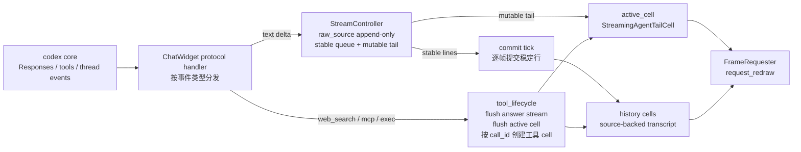
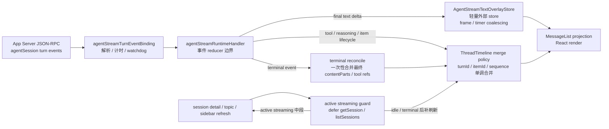
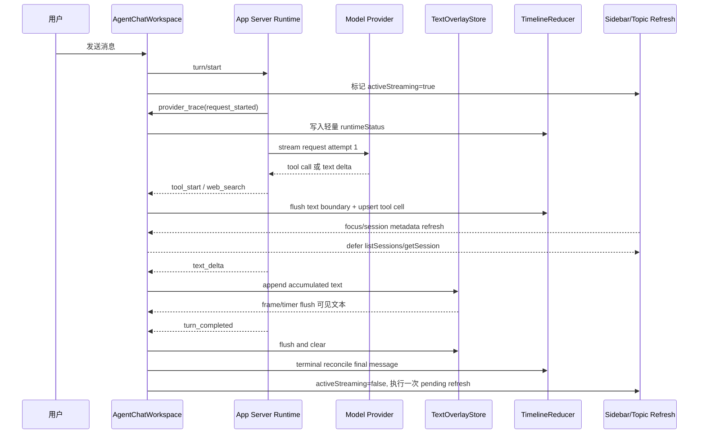
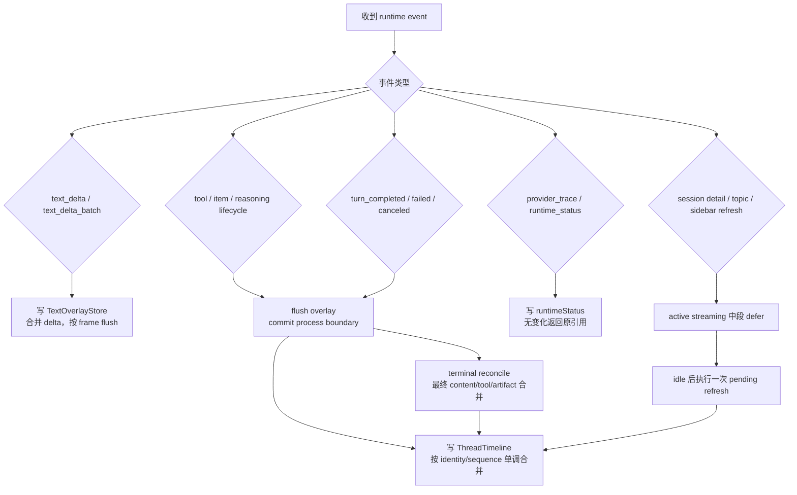

# Streaming Fluidity Architecture

> 状态：active-design-reference
> 更新时间：2026-07-02
> 关联入口：`internal/roadmap/thread/README.md` §23

本文记录 Codex 流式输出流畅性的设计对照，以及 Lime Agent Chat 后续性能重构的目标模型。主 README 只保留索引；架构图、时序图和流程图集中放在本文，避免路线图入口继续膨胀。

## 1. 核心结论

Codex 的流畅输出不是靠更快地把每个 token 写进 UI 状态树，而是把 active stream、history cell、工具 lifecycle、redraw / commit tick 分层。Lime 必须避免每个 `text_delta` 都重建 React `messages` / `threadItems` 主体。

Lime 当前不是缺少 typed event / message parts / tool state 建模，而是这些模型还没有贯穿所有 fallback 路径：

- typed event 已存在：`src/lib/api/agentProtocol.ts` 的 `AgentEvent` 覆盖 `text_delta`、`text_delta_batch`、`tool_start`、`tool_end`、`item_*`、`turn_*`、`reasoning_*`、`plan_*`、`action_*` 等 lifecycle，并通过 envelope 承载 `sequence / turn_id / itemId / phase`。
- message parts 已存在：`src/components/agent/chat/types.ts` 的 `ContentPart[]` 是 renderer 输入，`text / thinking / tool_use / action_required / file_changes_batch` 已能表达交错流。
- tool state 已存在：`AgentToolCallState`、`AgentThreadToolCallItem`、`AgentThreadItem`、runtime handler 的 tool id maps 与 read model thread items 已经能承载 running / completed / failed。
- 当前主缺口：`Message.content`、无 metadata text part、无 phase legacy delta、session hydrate fallback 和部分 WebTools / 内容工厂完成态断言仍可能绕开 `ContentPart[]` / tool lifecycle，导致搜索前导语、搜索过程和最终正文按正文内容或完成态字符串重新拼接。
- 因此本路线图不重建协议；下一刀是把 legacy fallback 收敛到 typed event boundary：process boundary 前的 legacy 文本提交为普通 text part，process boundary 后的无结构化文本 fail closed，内容工厂与普通聊天使用同一套 WebSearch call boundary。

## 2. Codex 流式输出架构图

关键点：

1. `StreamController` 持有 append-only 原文和渲染后的稳定区 / 尾部区；UI 只绘制当前 snapshot，不把每个 token 写成新的 transcript cell。
2. 稳定内容通过 commit tick 分批进入 history；尾部内容保持 mutable active cell，避免表格、换行、Markdown 结构在每个 delta 时反复重排整段历史。
3. 工具开始前先 flush answer stream 和 active cell；每个 WebSearch 以 `call_id` 独立成 cell，不跨搜索合并。
4. `request_redraw` 是轻量重绘请求，不等于重建完整应用状态树。

## 3. Lime 目标架构图

Lime 的 current / target 分工：

| 层级                      | 写入内容                                      | 性能规则                                                                 |
| ------------------------- | --------------------------------------------- | ------------------------------------------------------------------------ |
| `TextOverlayStore`        | 正在增长的 final answer 可见文本              | delta 合并后按 frame / 短 timer 更新；不逐 token 写 `messages`           |
| `ThreadTimeline merge`    | tool lifecycle、reasoning、agent_message item | 只按结构化 identity 单调合并；无变化必须返回原引用                       |
| `MessageList projection`  | 可见消息、工具过程、overlay                   | 从状态投影 UI；不承担业务合并策略                                        |
| `session detail refresh`  | history hydrate / terminal reconcile          | active streaming 中段只补 metadata 或延后；不得覆盖 live transcript 主体 |
| `Sidebar / topic preview` | 最近会话、标题、状态、preview                 | streaming 期间合并延后，避免插入多组 `runtimeListSessions`               |

## 4. 首字与中段输出时序图

时序规则：

1. `provider_trace` 只补真实等待态，解决首字前空白；它不伪造 assistant 正文。
2. `text_delta` 进入 overlay，可见输出按帧合并；只有 process boundary / terminal 时才把最终文本提交进 `messages.contentParts`。
3. `tool_start` / `tool_end` 是结构化边界，必须先 flush overlay：边界前 legacy 文本提交为普通 text part，边界后的 legacy 文本不再当 final overlay；随后更新 timeline，避免正文尾部和工具 cell 乱序。
4. `runtimeGetSession` / `runtimeListSessions` 在 active streaming 期间默认延后；终态后合并一次补刷新。

## 5. 事件处理决策流程图

## 6. 当前差距与下一刀

用户日志里的卡顿可以拆成四类，不应混在“首字慢”一个指标里：

| 类型            | 日志信号                                                                 | 已收口 / 待收口                                                             |
| --------------- | ------------------------------------------------------------------------ | --------------------------------------------------------------------------- |
| 首字前无反馈    | `provider_trace` 早于 `firstTextDelta` 数秒                              | 已用真实 runtimeStatus 补位                                                 |
| 中段 UI 抢资源  | streaming 中反复 `runtimeGetSession` / 三组 `runtimeListSessions`        | 已延后 missing-session hydrate、topic list、sidebar recent refresh          |
| 逐 delta 重渲染 | final answer delta 伴随 `messages/contentParts/threadItems` 频繁写入风险 | 需要继续向 Codex `StreamController` 模型靠拢：overlay live、process boundary commit、terminal commit |
| legacy fallback 越权 | 无 phase 文本、完成态 `Message.content`、hydrate fallback 绕开 typed event / message parts | 已明确不重建协议；按 process boundary 收敛，禁止用搜索导语 / 新闻正文等自然语言切分 |
| 后端多 attempt  | `AgentStream.providerTrace attempt: 1..4`，每轮 6-13s                    | 待下钻 provider/tool synthesis 和 WebSearch provider 串行策略               |

下一刀原则：

1. 前端先确保 `text_delta` 不逐 token 重建 `messages` / `threadItems`；无实际变化的 state setter 必须返回原引用。
2. 工具 lifecycle 继续按 Codex cell 边界处理：新 WebSearch call 必须 flush 当前过程，不允许回并旧搜索。
3. 后端性能单独看 provider attempt 和 WebSearch 工具耗时，不能再用前端 paint 指标掩盖 runtime / provider 等待。
4. 所有优化都必须保留结构化事件事实源，不恢复关键词 search policy、route remount key 或 session detail 覆盖 live transcript。
