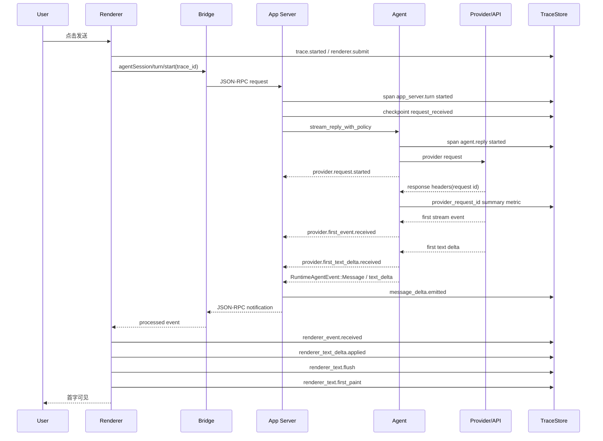
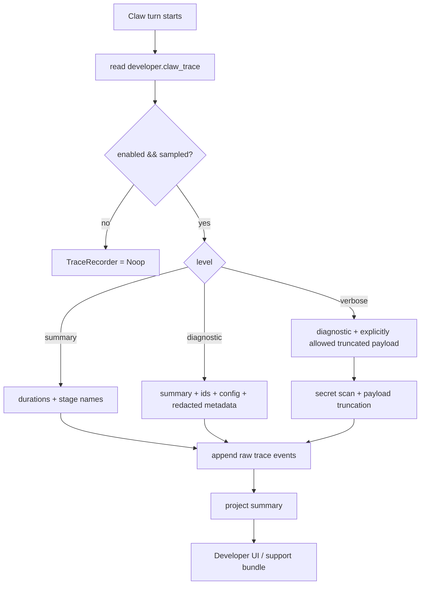
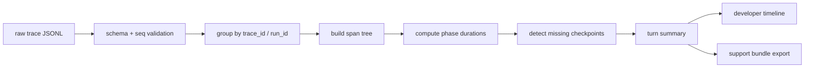

# Claw Trace 图表

> 状态：diagram draft
> 更新时间：2026-06-27

## 1. 总体架构图

```mermaid
flowchart LR
  subgraph Renderer["Renderer / Claw UI"]
    Submit["useWorkspaceSendActions\nsubmit trace context"]
    StreamHandler["agentStreamRuntimeHandler\napply / flush / paint checkpoints"]
    DevPanel["Developer & Labs\nTrace list / detail"]
  end

  subgraph Bridge["Electron Desktop Host / App Server Bridge"]
    JsonRpc["app_server_handle_json_lines\nJSON-RPC stream"]
  end

  subgraph AppServer["App Server"]
    Processor["processor\nagentSession/turn/start"]
    RuntimeBackend["runtime_backend\nturn / routing / event emit"]
    TraceRecorder["TraceRecorder\nappend-only raw events"]
    TraceStore["TraceStore\ndiagnostics/traces"]
    TraceProjector["TraceProjector\nsummary / flame data"]
  end

  subgraph Agent["Agent Backend"]
    Agent["agent.rs\nreply loop"]
    ApiClient["api_client.rs\nresponse header capture"]
    ReplyParts["reply_parts.rs\nprovider stream decode"]
    Provider["Provider API"]
  end

  Submit --> JsonRpc --> Processor --> RuntimeBackend --> Agent --> ReplyParts --> ApiClient --> Provider
  Provider --> ApiClient --> ReplyParts --> Agent --> RuntimeBackend --> JsonRpc --> StreamHandler
  Submit -.trace context.-> RuntimeBackend
  RuntimeBackend -.events.-> TraceRecorder
  ApiClient -.provider request id headers.-> Agent
  Agent -.provider_trace events.-> RuntimeBackend
  RuntimeBackend -.provider.* checkpoints.-> TraceRecorder
  StreamHandler -.renderer checkpoints.-> TraceRecorder
  TraceRecorder --> TraceStore --> TraceProjector --> DevPanel
```

## 2. Claw Turn 时序图



## 3. 首字可见延迟拆分

```text
user_submit
  |
  | user_submit_to_provider_request_ms
  v
provider.request.started
  |
  | provider_wait_ms
  |   provider/API 负责：网络、排队、模型首 token、服务端推理
  v
provider.first_text_delta.received
  |
  | server_emit_after_provider_delta_ms
  |   Lime App Server / Agent 负责：事件映射、投影、emit
  v
app_server_message_delta_emitted
  |
  | bridge_delivery_ms
  |   bridge 负责：JSON-RPC / event drain / sequence gate
  v
renderer_event_received
  |
  | renderer_apply_ms
  |   renderer 负责：text_delta 解析、state 更新、overlay 写入
  v
renderer_first_text_delta_applied
  |
  | renderer_flush_ms
  |   renderer 负责：flush 调度、批量渲染策略
  v
renderer_first_text_render_flush
  |
  | renderer_paint_ms
  |   浏览器/React 负责：requestAnimationFrame 到实际 paint
  v
first_text_paint
```

## 4. 开关流程图



当前实现已落 App Server summary-only raw trace JSONL，并开放 `diagnostics/trace/list`、`diagnostics/trace/read`、`diagnostics/trace/export` 开发者读面：`Record` 不保存 raw AgentEvent payload / prompt / provider payload / assistant text；`Export` 只导出 summary-only trace zip，support bundle 附带 trace 也必须由开发者显式触发。

## 5. Trace 投影流程图



## 6. Trace 与 Runtime Event 的边界

```text
RuntimeEvent:
  面向产品和 read model，必须稳定表达发生了什么。

TraceEvent:
  面向诊断，表达什么时候发生、耗时多少、属于哪个 span。

禁止：
  TraceEvent 反向驱动产品状态。
  Renderer 用 TraceEvent 代替 RuntimeEvent 渲染消息。
  RuntimeEvent payload 为了 trace 塞入大块诊断数据。
```
