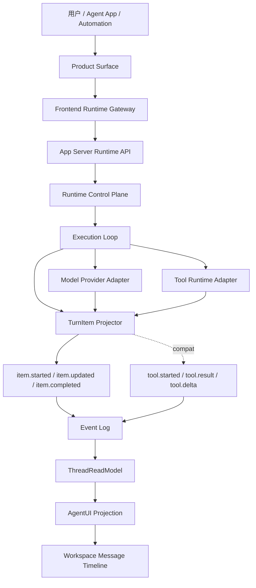
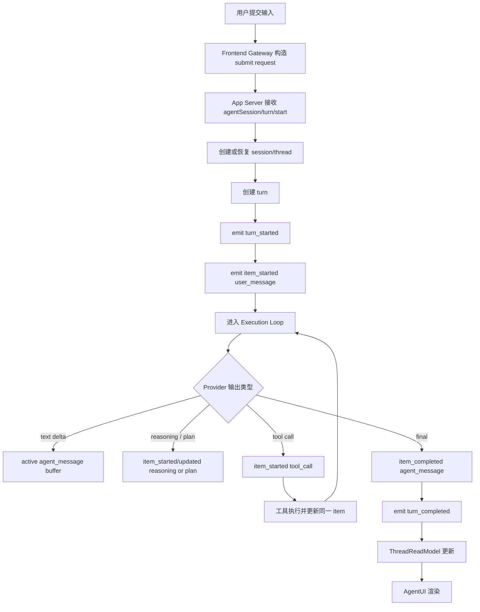
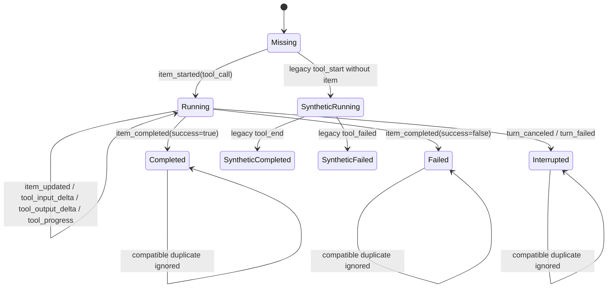
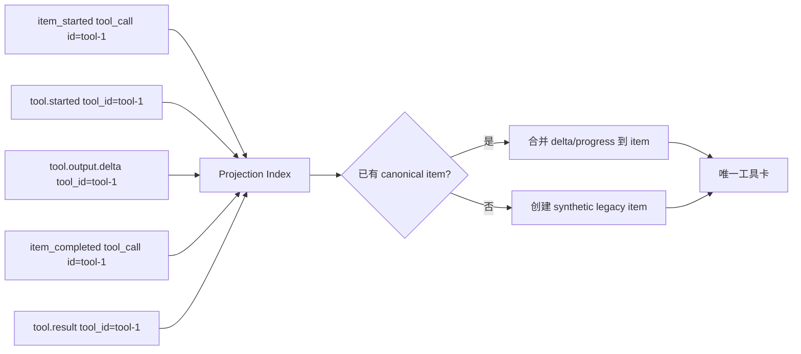
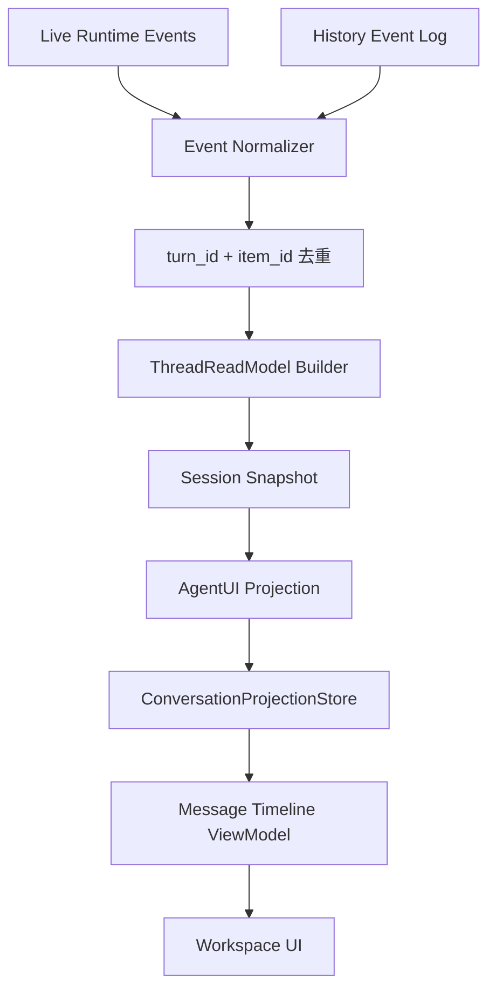
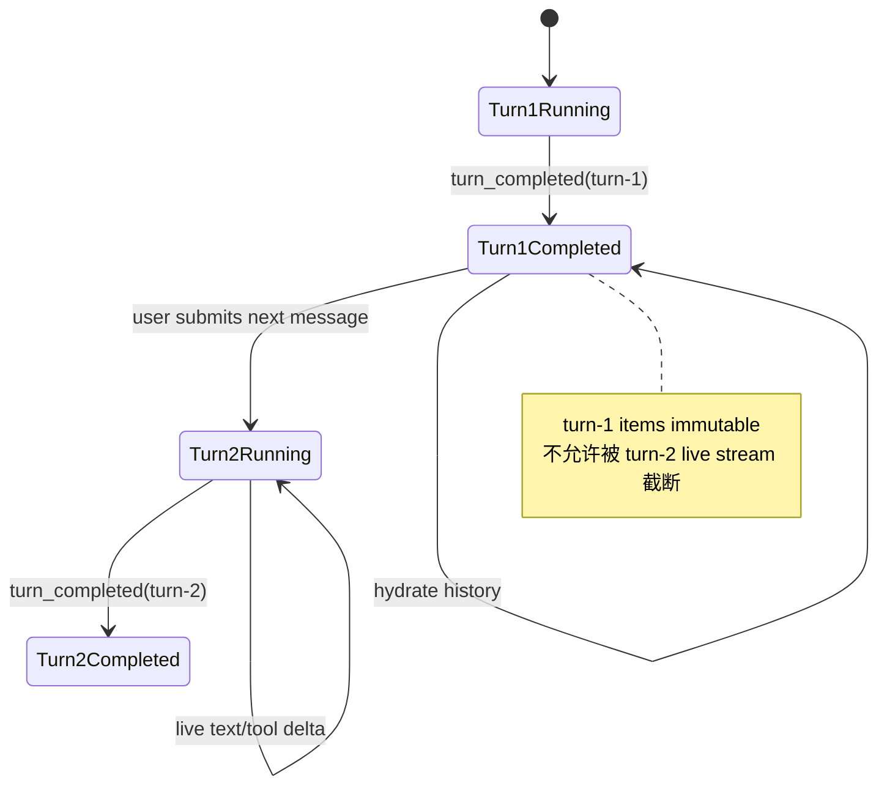
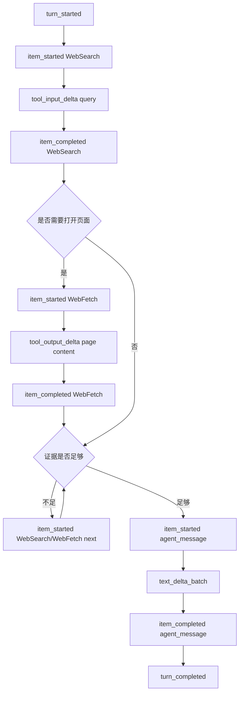
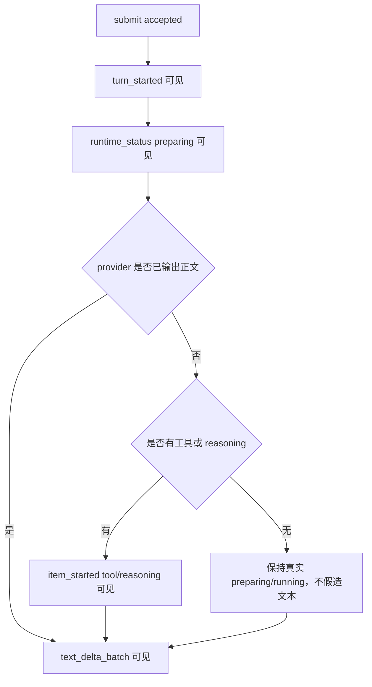
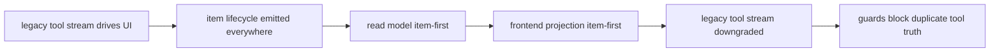

# Turn / Tool 生命周期图纸集

> 状态：design-drafted
> 更新时间：2026-06-18
> 作用：用 Mermaid 图固定 turn、item、tool、event log、read model 和 UI projection 的目标结构。

## 1. 总体架构图

约束：`ItemEvents` 是 current，`LegacyTool` 是 compat，不允许反向覆盖 item state。

## 2. Submit Turn 流程图

## 3. ToolCall 生命周期状态图

## 4. item-first 与 legacy tool 归并图

## 5. Event Log 到 UI 数据流

核心约束：live 和 history 都进入同一 `Normalize -> Dedupe -> Read -> Projection` 路径。

## 6. 连续两轮对话状态图

## 7. WebSearch / WebFetch 多工具流程

WebSearch 策略可以影响“是否足够”，但不能影响工具卡归属。

## 8. 首字慢可见性流程

目标：用户看到真实状态，不看到假进度。

## 9. 迁移图

退出条件：P5 完成后，新增工具能力只允许接入 item lifecycle。

