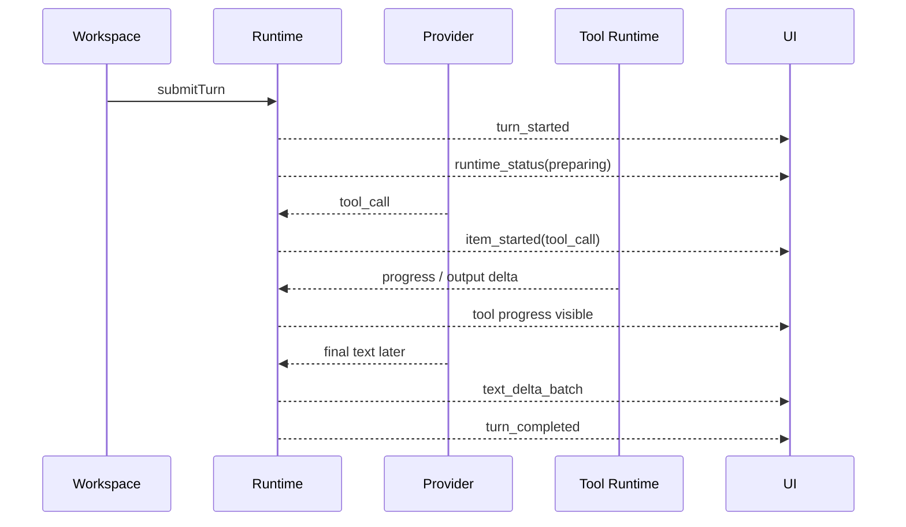
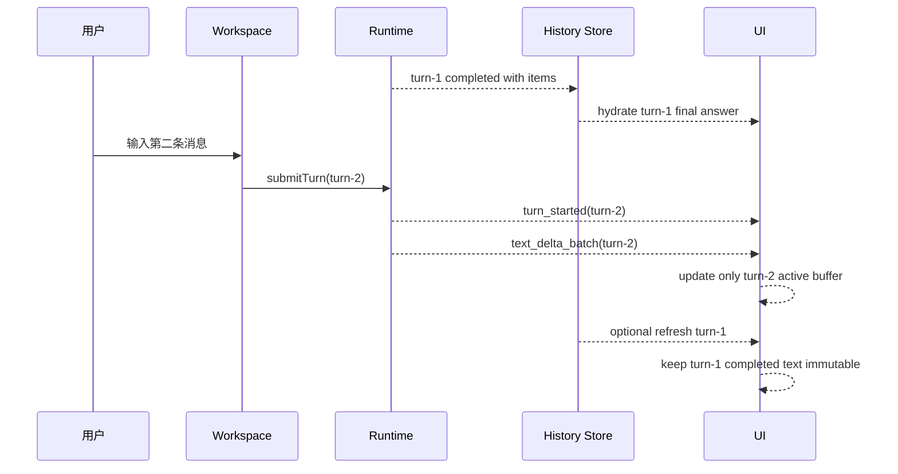
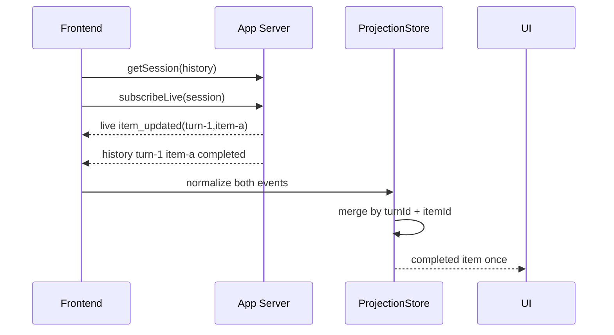

# Turn / Tool 生命周期时序图

> 状态：design-drafted
> 更新时间：2026-06-18
> 作用：固定关键运行场景的前后端时序，确保后续实现、测试和 E2E 使用同一判断口径。

## 1. 普通文本 turn

```mermaid
sequenceDiagram
    participant U as 用户
    participant FE as Workspace
    participant API as Frontend Gateway
    participant RT as App Server Runtime
    participant Loop as Execution Loop
    participant RM as ThreadReadModel
    participant UI as AgentUI Projection

    U->>FE: 输入普通问题
    FE->>API: submitTurn(input)
    API->>RT: agentSession/turn/start
    RT-->>API: accepted(sessionId, turnId)
    RT-->>RM: turn_started
    RT-->>RM: item_started(user_message)
    RM-->>UI: turn running
    Loop-->>RM: item_started(agent_message)
    Loop-->>RM: text_delta_batch*
    Loop-->>RM: item_completed(agent_message)
    Loop-->>RM: turn_completed
    RM-->>UI: completed timeline
```

关键断言：

1. `text_delta_batch` 只进入 active `agent_message`。
2. `turn_completed` 后 active buffer 清空。
3. 历史中 final text 不再依赖 stream buffer。

## 2. WebSearch / WebFetch 多工具 turn

```mermaid
sequenceDiagram
    participant FE as Workspace
    participant RT as Runtime
    participant Loop as Execution Loop
    participant Model as Provider
    participant Tool as Tool Runtime
    participant RM as ThreadReadModel
    participant UI as UI

    FE->>RT: submitTurn(web request)
    RT-->>RM: turn_started
    RT-->>RM: item_started(user_message)
    Loop->>Model: request with tools
    Model-->>Loop: tool_call WebSearch(call_id=search-1)
    Loop-->>RM: item_started(tool_call search-1)
    Loop-->>RM: tool_input_delta(search-1)
    Loop->>Tool: execute WebSearch
    Tool-->>Loop: result
    Loop-->>RM: item_completed(tool_call search-1)
    Model-->>Loop: tool_call WebFetch(call_id=fetch-1)
    Loop-->>RM: item_started(tool_call fetch-1)
    Loop-->>RM: tool_output_delta(fetch-1)
    Tool-->>Loop: result
    Loop-->>RM: item_completed(tool_call fetch-1)
    Loop->>Model: synthesize answer
    Model-->>Loop: final text
    Loop-->>RM: item_completed(agent_message)
    Loop-->>RM: turn_completed
    RM-->>UI: WebSearch / WebFetch / final answer 独立展示
```

关键断言：

1. `search-1` 和 `fetch-1` 是两个独立 item。
2. `tool_output_delta(fetch-1)` 不会追加到 `search-1`。
3. final answer 是 `agent_message`，不是工具输出。

## 3. 同一工具 item 与 legacy tool event 混合

```mermaid
sequenceDiagram
    participant BE as Backend
    participant RM as ReadModel
    participant Store as ProjectionStore
    participant UI as UI

    BE-->>RM: item_started(tool_call id=tool-1)
    BE-->>RM: tool.started(tool_id=tool-1)
    RM-->>Store: canonical item running
    Store-->>UI: one tool card
    BE-->>RM: tool.output.delta(tool_id=tool-1)
    RM-->>Store: append transient output to tool-1
    BE-->>RM: item_completed(tool_call id=tool-1)
    BE-->>RM: tool.result(tool_id=tool-1)
    RM-->>Store: canonical item completed; legacy result ignored as terminal duplicate
    Store-->>UI: one completed tool card
```

关键断言：

1. UI 只有一张工具卡。
2. legacy terminal event 不覆盖 canonical item。
3. conflict 只进入 diagnostics。

## 4. 首字慢但工具先出现



关键断言：

1. 首个可见状态不需要等 final text。
2. 不用前端假 loading 文案。
3. 真正慢的是 provider text，不是 UI 卡住。

## 5. Provider 尾段失败但已有工具结果

```mermaid
sequenceDiagram
    participant Loop as Execution Loop
    participant Model as Provider
    participant Tool as Tool Runtime
    participant RM as ReadModel
    participant UI as UI

    Loop->>Model: request
    Model-->>Loop: tool_call(tool-1)
    Loop-->>RM: item_started(tool-1)
    Tool-->>Loop: result
    Loop-->>RM: item_completed(tool-1)
    Model--xLoop: stream disconnected near tail
    Loop-->>RM: runtime_status(provider_tail_failure)
    alt retry/synthesis allowed
        Loop->>Model: continue with existing tool result
        Model-->>Loop: final answer
        Loop-->>RM: item_completed(agent_message)
        Loop-->>RM: turn_completed
    else not recoverable
        Loop-->>RM: turn_failed with preserved completed items
    end
    RM-->>UI: completed tool remains visible
```

关键断言：

1. 已完成工具不被失败 turn 抹掉。
2. retry 不重复已完成工具，除非模型明确需要新证据。
3. UI 显示保留的工具结果和失败/恢复状态。

## 6. 第二轮输入不截断上一轮



关键断言：

1. turn-2 stream 不访问 turn-1 buffer。
2. history refresh 不用 partial active buffer 覆盖 completed text。
3. timeline 按 turn 分组渲染。

## 7. 历史 hydrate 与 live stream 同时到达



关键断言：

1. merge key 是 `turnId + itemId`，不是数组位置。
2. terminal item 优先级高于 transient update。
3. 同一 item 不重复展示。

## 8. Action / approval 工具等待点

```mermaid
sequenceDiagram
    participant Loop as Execution Loop
    participant Policy as Policy
    participant RM as ReadModel
    participant UI as UI
    participant Tool as Tool Runtime

    Loop->>Policy: evaluate tool call
    Policy-->>Loop: ask
    Loop-->>RM: item_started(approval_request)
    Loop-->>RM: item_started(tool_call status=in_progress metadata.waiting_action)
    RM-->>UI: show approval
    UI->>Loop: respond_action(approve)
    Loop-->>RM: item_completed(approval_request)
    Loop->>Tool: execute tool
    Tool-->>Loop: result
    Loop-->>RM: item_completed(tool_call)
```

关键断言：

1. approval request 是 item，不是 message 文本。
2. 工具等待态和 approval action 可用 id join。
3. 拒绝审批时 tool item 终态为 failed / denied。

