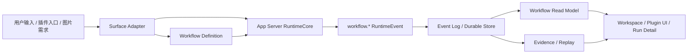
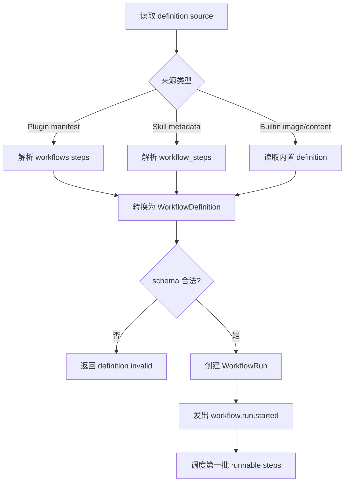
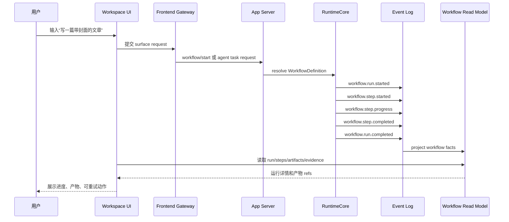
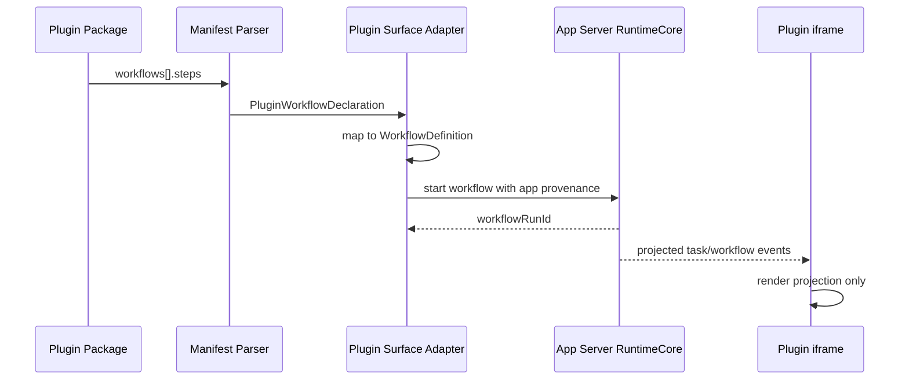
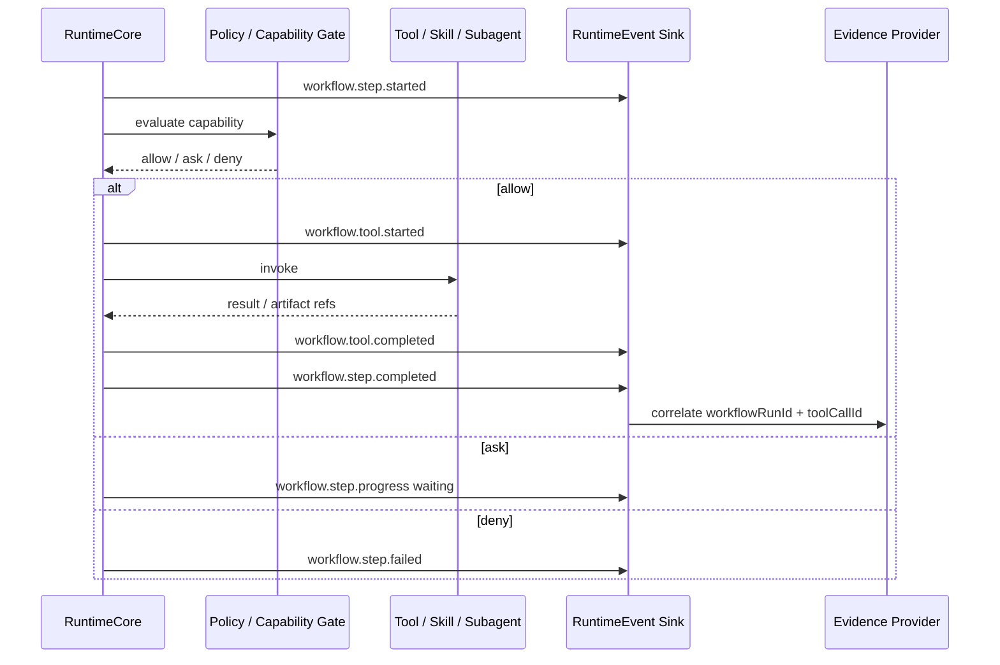
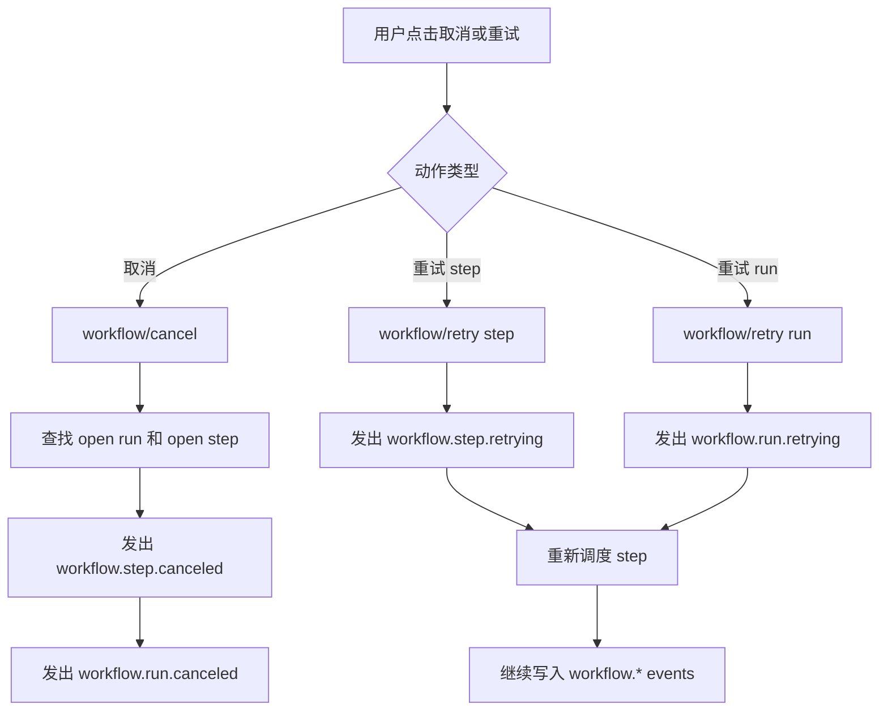
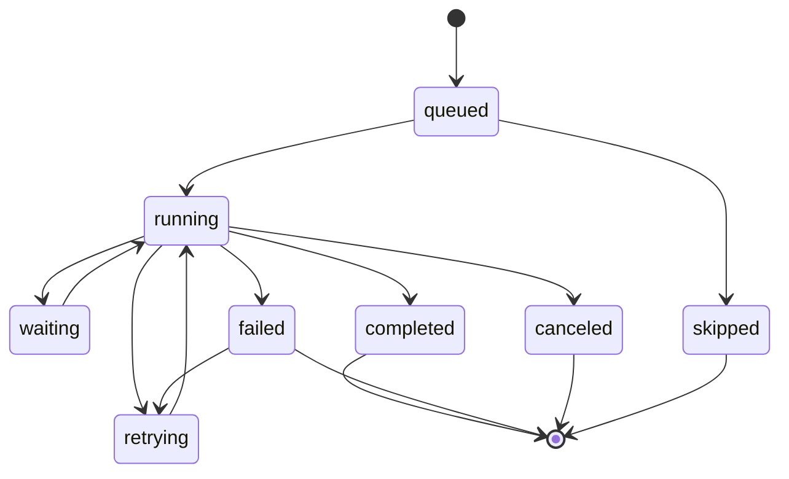
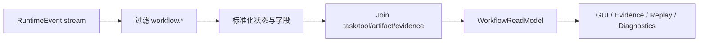
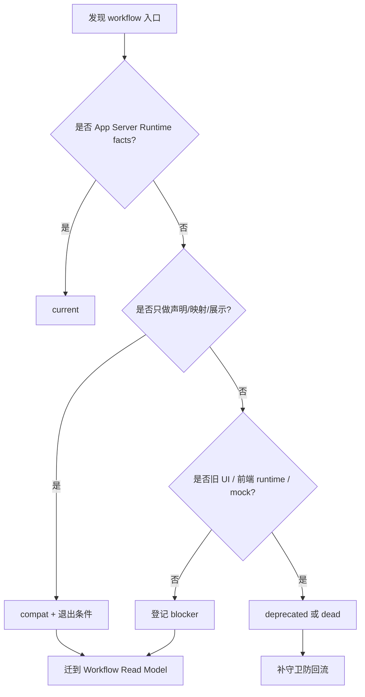

# Workflow 图集

> 状态：current planning source
> 更新时间：2026-07-03
> 作用：集中放置 Workflow 标准化相关的架构图、流程图和时序图。

## 1. 总体架构图

## 2. Definition 到 Run 流程图

## 3. 用户启动内容 workflow 时序图

## 4. Plugin manifest workflow 映射时序图

## 5. Step 执行和工具事件时序图

## 6. Cancel / Retry 流程图

## 7. 状态流转图

## 8. Read Model 投影流程图

## 9. 治理退场流程图

